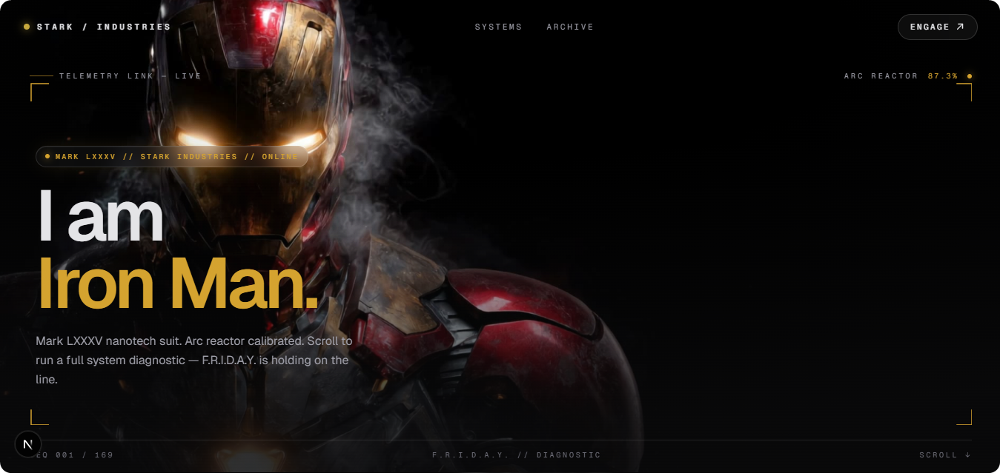

# Stark Industries - Mark LXXXV Cinematic Interface

A cinematic, interactive web experience paying tribute to Tony Stark's Mark LXXXV armor from *Avengers: Endgame*. This project features scroll-based HTML5 Canvas animations, dynamic cinematic reveals, and immersive HUD components.

## Features

- **Interactive Canvas Animations:** Scroll-based frame sequences utilizing rendered images for a smooth, cinematic visual flow.
- **Dynamic Theme Transitions:** CSS animations and state management orchestrate fluid transitions from the classic Stark Yellow to an Arc Reactor Blue at key story beats.
- **Cinematic Storytelling:** Carefully timed dialogue cards, telemetry data, and UI elements synced to the scroll progress.
- **Responsive Design:** Optimized for both desktop and mobile, ensuring the F.R.I.D.A.Y. interface scales perfectly.

## Tech Stack

- **Framework:** [Next.js](https://nextjs.org) (App Router)
- **Library:** [React](https://react.dev)
- **Styling:** [Tailwind CSS](https://tailwindcss.com)
- **Animation:** HTML5 Canvas API & CSS transitions

## Getting Started

First, install the dependencies:

\\\ash
npm install
\\\

Run the development server:

\\\ash
npm run dev
\\\

Open [http://localhost:3000](http://localhost:3000) with your browser to interact with the interface.

## Disclaimer

This is a proof of concept and fan art. It is not affiliated with or endorsed by Marvel, Disney, or Stark Industries. No commercial use intended.
